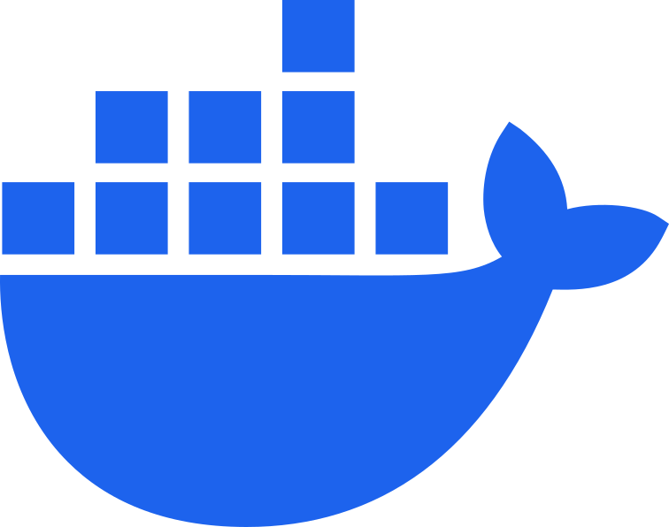

<h1>Hey there, I'm Viktor!</h1>

  
### About Me :

Passionate Software Engineer | Web Design Enthusiast

### Languages :

<table  align="center">
  <tr>
    
        🇺🇦 Ukrainian - Native
        
  </tr>

  <tr>
    
        🇬🇧 English - Intermediate
        
  </tr>
</table>

### My stack and tools :

  <table>
    <tr>
      <td align="center" width="88">
        
         HTML5
      </td>
      <td align="center" width="88">
        
         CSS3
      </td>
      <td align="center" width="88">
        
         JavaScript
      </td>
      <td align="center" width="88">
        
         TypeScript
      </td>
      <td align="center" width="88">
        
         Python
      </td>
      <td align="center" width="88">
        
         React.js
      </td>
      <td align="center" width="88">
        
         Next.js
      </td>
      <td align="center" width="88">
        
         Node.js
      </td>
      <td align="center" width="88">
        
         .NET
      </td>
    </tr>
    <tr>
      <td align="center" width="88">
        
         Sass
      </td>
      <td align="center" width="88">
        
         Tailwind
      </td>
      <td align="center" width="88">
        
         MongoDB
      </td>
      <td align="center" width="88">
        
         PostgreSQL
      </td>
      <td align="center" width="88">
        
         Drizzle
      </td>
      <td align="center" width="88">
        
         Redis
      </td>
      <td align="center" width="88">
        
         Docker
      </td>
      <td align="center" width="88">
        
         Kubernetes
      </td>
      <td align="center" width="88">
        
         AWS
      </td>
    </tr>
  </table>

### GitHub Stats :

  

 
 

  
 

 

<a href="https://www.codewars.com/users/ViktorSvertoka">

 

